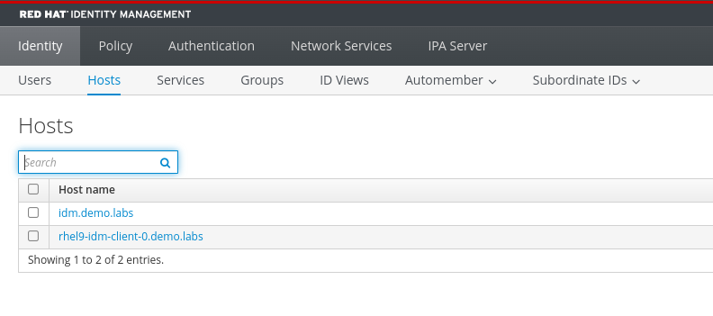
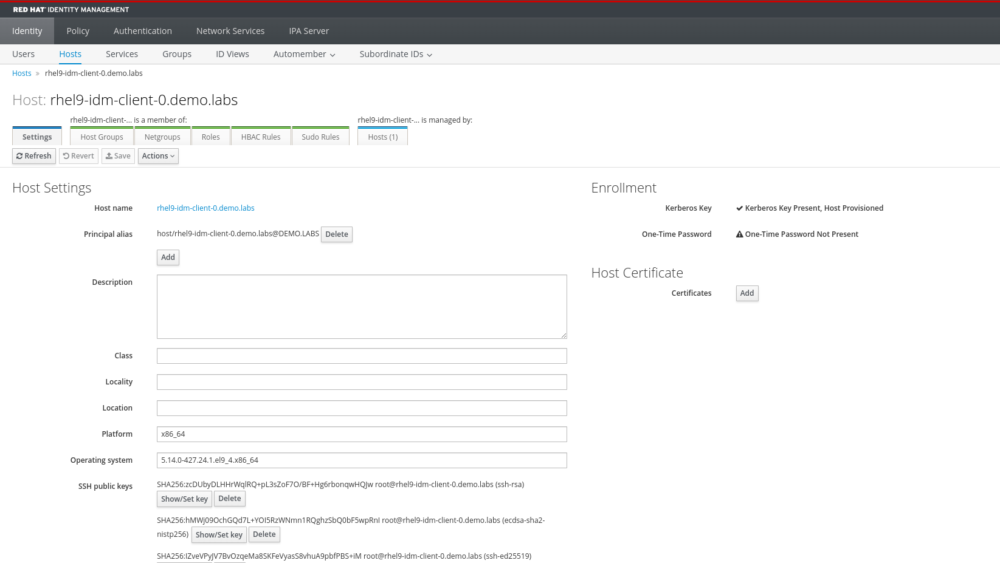

# Enrolling a client to IdM

In this section we will configure enroll a client to IdM.

## Install required packages

SSH into one of the created clients:

```bash
ssh sysadmin@rhel9-idm-client-0.demo.labs
```

```bash
❯ ssh sysadmin@rhel9-idm-client-0.demo.labs
sysadmin@rhel9-idm-client-0.demo.labs's password: 
Register this system with Red Hat Insights: insights-client --register
Create an account or view all your systems at https://red.ht/insights-dashboard
Last login: Tue Jul 16 03:39:41 2024 from 192.168.254.1
[sysadmin@rhel9-idm-client-0 ~]$ 
```

Install required *ipa-client* package:

```bash
sudo dnf install ipa-client -y
```

And let's proceed with the ipa-client setup:

```bash
sudo ipa-client-install
```

It will try auto-discovering Identity Management DNS record for your domain, and will prompt for a *realm admin* username and password to enroll the client. When prompted, use the default **admin/admin123** and accept the defaults. We will use the **--mkhomedir** argument to enable auto-creation of user's home directories upon the first login.

```bash
[sysadmin@rhel9-idm-client-0 ~]$ sudo ipa-client-install --mkhomedir
This program will set up IPA client.
Version 4.11.0

Discovery was successful!
Do you want to configure chrony with NTP server or pool address? [no]: 
Client hostname: rhel9-idm-client-0.demo.labs
Realm: DEMO.LABS
DNS Domain: demo.labs
IPA Server: idm.demo.labs
BaseDN: dc=demo,dc=labs

Continue to configure the system with these values? [no]: yes
Synchronizing time
No SRV records of NTP servers found and no NTP server or pool address was provided.
Using default chrony configuration.
Attempting to sync time with chronyc.
Time synchronization was successful.
User authorized to enroll computers: admin
Password for admin@DEMO.LABS: 
Successfully retrieved CA cert
    Subject:     CN=Certificate Authority,O=DEMO.LABS
    Issuer:      CN=Certificate Authority,O=DEMO.LABS
    Valid From:  2024-07-16 07:52:09+00:00
    Valid Until: 2044-07-16 07:52:09+00:00

Enrolled in IPA realm DEMO.LABS
Created /etc/ipa/default.conf
Configured /etc/sssd/sssd.conf
Systemwide CA database updated.
Hostname (rhel9-idm-client-0.demo.labs) does not have A/AAAA record.
Adding SSH public key from /etc/ssh/ssh_host_rsa_key.pub
Adding SSH public key from /etc/ssh/ssh_host_ecdsa_key.pub
Adding SSH public key from /etc/ssh/ssh_host_ed25519_key.pub
SSSD enabled
Configured /etc/openldap/ldap.conf
Configured /etc/ssh/ssh_config
Configured /etc/ssh/sshd_config.d/04-ipa.conf
Configuring demo.labs as NIS domain.
Configured /etc/krb5.conf for IPA realm DEMO.LABS
Client configuration complete.
The ipa-client-install command was successful
```

Up to this point, everything should be fine, the system has been configured and joined the Identity Management Kerberos realm, let's proceed with some checks.

## Verify host registration

### Using the IdM GUI

Red Hat Identity Management setup also configures a web UI that can be accessed using the following data:

|  |  | 
| - | - | 
| URL | [https://idm.demo.labs](https://idm.demo.labs) | 
| User | admin | 
| Password | admin123 | 


Under the **Hosts** tab, you can verify that the new server is present:



By clicking on the host name, you can access the related details.



### Using the CLI

You can also verify that the setup completed successfully trying to issue a *ipa* command to find the server.

```bash
ipa server-find
```

The utility is present, but the command will fail, as we need a Kerberos ticket for the *rhel9-idm-client-0.demo.labs* server.

```bash
[sysadmin@rhel9-idm-client-0 ~]$ ipa server-find
ipa: ERROR: did not receive Kerberos credentials
```

To perform this operation, we will use the **kinit** utility and try to issue the ticket with user *admin*, when prompted, input **admin123** as the password:

```bash
kinit admin
```

Now we can issue a command to show that the configuration

```bash
ipa server-find
```

```bash
[sysadmin@rhel9-idm-client-0 ~]$ ipa server-find
--------------------
1 IPA server matched
--------------------
  Server name: idm.demo.labs
  Min domain level: 1
  Max domain level: 1
----------------------------
Number of entries returned 1
----------------------------
```

The output looks way better, we were able to issue a Kerberos ticket and access server information.

### Logging in as an IdM user

Now let's try to use the use the *admin* user to log into the server.

In another shell, let's try to ssh into the server using the *admin* user.

```bash
ssh admin@rhel9-idm-client-0.demo.labs
```

Using the password **admin123** we will be able to login.

```bash
❯ ssh admin@rhel9-idm-client-0.demo.labs
(admin@rhel9-idm-client-0.demo.labs) Password: 
Register this system with Red Hat Insights: insights-client --register
Create an account or view all your systems at https://red.ht/insights-dashboard
```

Verify that the */home/admin* directory has been created

```bash
ls -latr /home/admin
```

```bash
[admin@rhel9-idm-client-0 ~]$ ls -latr /home/admin/
total 12
drwxr-xr-x. 4 root  root    35 Jul 17 04:47 ..
-rw-------. 1 admin admins 492 Jul 17 04:47 .bashrc
-rw-------. 1 admin admins 141 Jul 17 04:47 .bash_profile
-rw-------. 1 admin admins  18 Jul 17 04:47 .bash_logout
drwx------. 2 admin admins  62 Jul 17 04:47 .
```

Everything is configured and ready to be used.