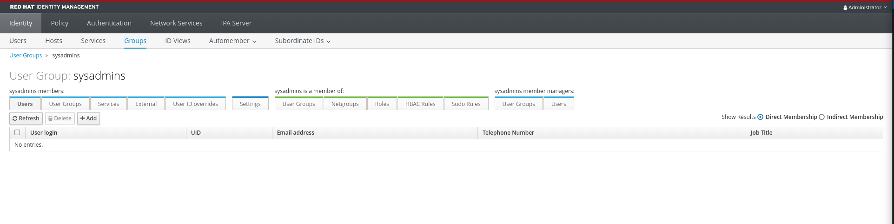
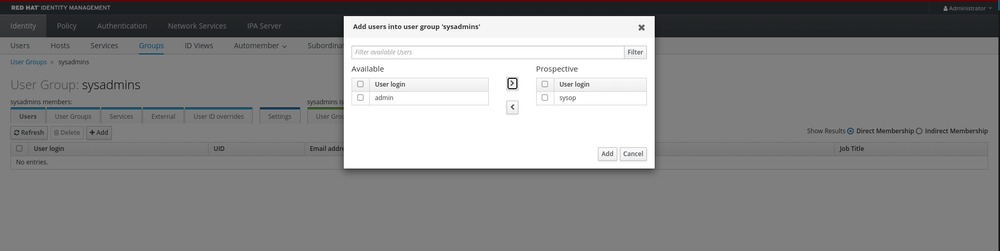
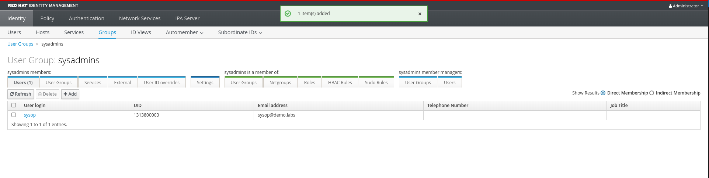

# User Group Management

In this section we will configure groups in IdM and see how we can extend permissions and membership across multiple users.

## User Groups management overview

To create users, we will use the GUI provided by Red Hat Identity Management. The same operations and further customization can also be performed using the CLI [as shown in the documentation](https://docs.redhat.com/en/documentation/red_hat_enterprise_linux/9/html/managing_idm_users_groups_hosts_and_access_control_rules/managing-user-groups-in-idm-cli_managing-users-groups-hosts).

Groups in IdM have can be of three different types, *POSIX*, *non-POSIX*, *External*

* POSIX -> The default type, they have a dedicated gid and uid and cannot be used to interact with Active Directory
* non-POSIX -> Groups of non-POSIX type cannot have POSIX attributes set (i.e. a GID)
* External -> These groups are groups that exist outside IdM and do not support POSIX attributes

> [!TIP]
> More details about group types can be found [in the documentation](https://docs.redhat.com/en/documentation/red_hat_enterprise_linux/9/html/managing_idm_users_groups_hosts_and_access_control_rules/managing-user-groups-in-idm-web-ui_managing-users-groups-hosts#the-different-group-types-in-idm_managing-user-groups-in-idm-web-ui)

For the scope of this use case, we will focus on POSIX groups.

## Create a user group

Access the Web Interface using the following information:

|  |  | 
| - | - | 
| URL | [https://idm.demo.labs](https://idm.demo.labs) | 
| User | admin | 
| Password | admin123 | 

In the **Identity**->**Groups** tab, stay in the *User Groups* view and click on Add. 

Fill the form with the following values:

| | |
| - | - |
| Group name | sysadmins | 


Leave other fields unchanged, your window will look like this:


Click on "Add", and when back in the main page, click in the **sysadmins** group to review the details.

## Adding users to a group

Now go back on the IdM Web UI, access the group details under **Identity**->**Groups**->**sysadmin**.

By default the page will show the Users that are members of the group, and at this point in time it is empty.



Let's add our **sysop** user to the group.

In the Group details under the *sysadmin members* -> *Users* section:

- Click on **Add**
- Select the sysop user
- Click on the right arrow to move the user to the group
- Click on **Add**



As a result, our user **sysop** user is now part of the **sysadmins** user group.



## Verify user membership

Login now to the host using the SSH key we create in [the previous steps](../users-management/README.md).

```bash
ssh -i idm_key sysop@rhel9-idm-client-0.demo.labs
```

Run the *id* command again and verify that now our user belongs to the *sysadmins* group:

```bash
id
```

```bash
[sysop@rhel9-idm-client-0 ~]$ id
uid=1313800003(sysop) gid=1313800003(sysop) groups=1313800003(sysop),1313800004(sysadmins) context=unconfined_u:unconfined_r:unconfined_t:s0-s0:c0.c1023
```
