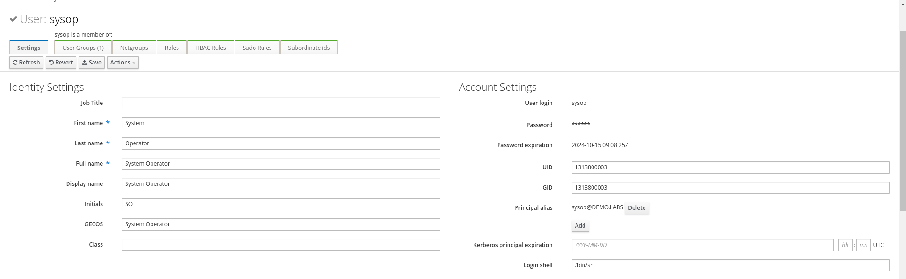

# Users Management

In this section we will configure users in IdM and see how we can tailor access permissions to hosts

## Users management overview

To create users, we will use the GUI provided by Red Hat Identity Management. The same operations and further customization can also be performed using the CLI [as shown in the documentation](https://docs.redhat.com/en/documentation/red_hat_enterprise_linux/9/html/managing_idm_users_groups_hosts_and_access_control_rules/managing-user-accounts-using-the-command-line_managing-users-groups-hosts).

Users in IdM have a dedicated lifecycle, and can have three different states, *Active*, *Stage*, *Preserved*

* Stage -> Users are not allowed to authenticate and some operation on them cannot be performed, like group management.
* Active -> Users in this state are fully functional and can be used for any operation.
* Preserved -> Users in this state are 'archived' meaning that they are not able to authenticate but preserve all settings they had when active, but are removed from groups.

> [!TIP]
> More details about users lifecycle can be found [in the documentation](https://docs.redhat.com/en/documentation/red_hat_enterprise_linux/9/html/managing_idm_users_groups_hosts_and_access_control_rules/managing-user-accounts-using-the-idm-web-ui_managing-users-groups-hosts#user-life-cycle_managing-user-accounts-using-the-idm-web-ui)

For the scope of this use case, we will focus on active users.

## Create a user

Access the Web Interface using the following information:

|  |  | 
| - | - | 
| URL | [https://idm.demo.labs](https://idm.demo.labs) | 
| User | admin | 
| Password | admin123 | 

In the **Identity**->**Users** tab, stay in the *Active users* view and click on Add. 

Fill the form with the following values:

| | |
| - | - |
| User login | sysop | 
| First name | System | 
| Last name | Operator | 
| New Password | redhat |
| Verify Password | redhat | 

Leave other fields blank, your window will look like this:


Click on "Add", and when back in the main page, click in the **sysop** user to review the details.

## Login with the new user

Upon creation, the chosen password must be changed upon first login, let's verify that the user is correctly created and change its password.

```bash
ssh sysop@rhel9-idm-client-0.demo.labs
```

Verify that the password expired and set **redhat123** as the password.

```bash
❯ ssh sysop@rhel9-idm-client-0.demo.labs
(sysop@rhel9-idm-client-0.demo.labs) Password: 
(sysop@rhel9-idm-client-0.demo.labs) Password expired. Change your password now.
Current Password: 
(sysop@rhel9-idm-client-0.demo.labs) New password: 
(sysop@rhel9-idm-client-0.demo.labs) Retype new password: 
Register this system with Red Hat Insights: insights-client --register
Create an account or view all your systems at https://red.ht/insights-dashboard
```

Great, we are in! Let's have a look at the user information using the *id* command

```bash
id
```

As you will see, the user GID and UID match the ones in the user details on IdM web UI:

```bash
[sysop@rhel9-idm-client-0 ~]$ id
uid=1313800003(sysop) gid=1313800003(sysop) groups=1313800003(sysop) context=unconfined_u:unconfined_r:unconfined_t:s0-s0:c0.c1023
```



## Configuring an SSH key for the user sysop

Open a connection to the *rhel9-idm-client-0.demo.labs host* with user *sysops* and password *redhat123*

```bash
ssh sysop@rhel9-idm-client-0.demo.labs
```

Let's create an SSH key pair for the user on your laptop in the current folder:

```bash
ssh-keygen -t rsa -f idm_key
```

```bash
❯ ssh-keygen -t rsa -f idm_key
Generating public/private rsa key pair.
Enter passphrase (empty for no passphrase): 
Enter same passphrase again: 
Your identification has been saved in idm_key
Your public key has been saved in idm_key.pub
The key fingerprint is:
SHA256:qEQ3ifjKs+ealDLbgRPt+wFsCVZtg1oDQBWHM3ayQOk alerossi@homeland
The key's randomart image is:
+---[RSA 3072]----+
|=+++=.           |
| o.@.* .         |
|o.* @ =          |
|.E = . o         |
|. * o . S        |
| * = .           |
|= O o            |
| B *..           |
|. *=o            |
+----[SHA256]-----+
```

Change the permissions of the keys to *600*:

```bash
chmod 600 idm_key*
```

Retrieve the content of the public key:

```bash
cat idm_key.pub
```

Now go back on the IdM Web UI, access the user details under **Identity**->**Users**->**sysop** and go in the *SSH public keys", click on "Add" and paste the content of the previous command.

In the users details section click on **Save** and verify that the user now has an SSH key associated with it.


Now let's try to SSH in the host using the private key we generated:

```bash
ssh -i idm_key sysop@rhel9-idm-client-0.demo.labs
```

Et voilà, we are now logged in using the SSH key for the user *sysop*

```bash
❯ ssh -i idm_key sysop@rhel9-idm-client-0.demo.labs
Register this system with Red Hat Insights: insights-client --register
Create an account or view all your systems at https://red.ht/insights-dashboard
Last login: Wed Jul 17 05:21:04 2024 from 192.168.254.1
[sysop@rhel9-idm-client-0 ~]$
```
